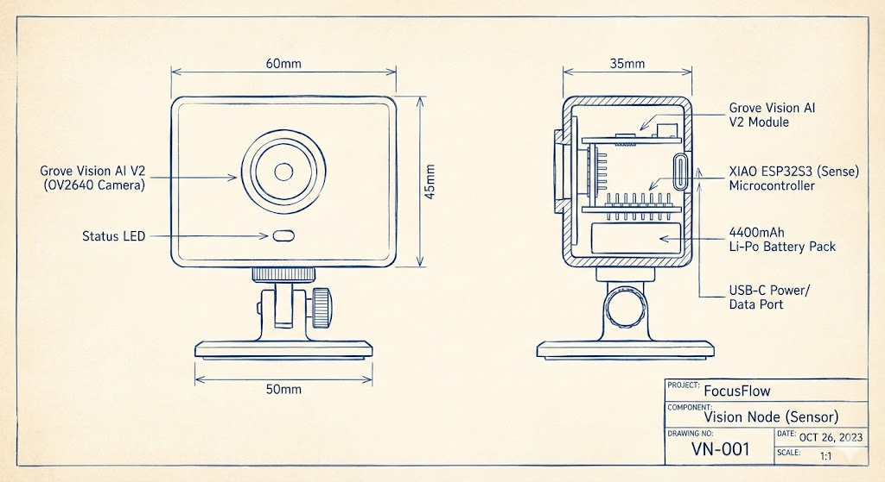
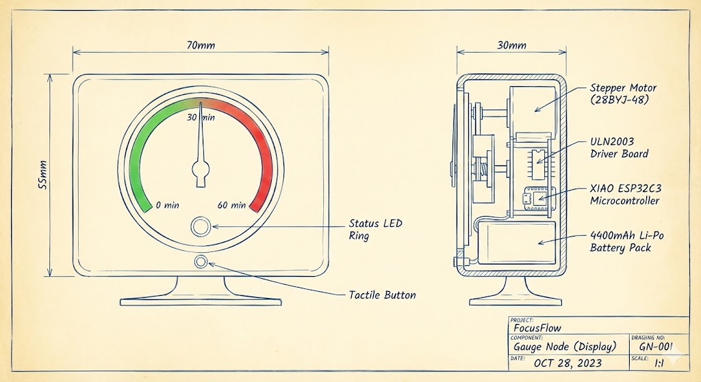
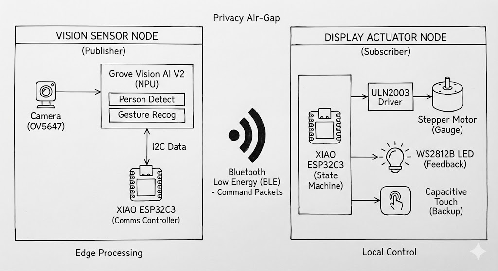

# Rest Radar
## Overview
**FocusFlow** (formerly Rest Radar) is a physical workspace wellness system designed to help you balance deep work and rest.

In the previous iteration, we used a wearable sensor. We found that wearables can be intrusive and easily forgotten. **FocusFlow** solves this by shifting to an **ambient computing** approach. It consists of two wireless desktop nodes:
1.  **Sensor:** A smart camera that passively detects your presence and understands gestures.
2.  **Visual:** A physical dial that visualizes your "focus stamina" without digital notifications.

## Key Features
* Presence Detection: Automatically starts the timer when you sit down and pauses when you leave using Edge AI (Computer Vision).
*  Gesture Control: Control the timer without breaking your flow:
    *  **Open Palm:** Pause/Resume Timer (e.g., for phone calls).
    *  **OK Sign:** Reset Session (Finish a break).
*  Analog Visualization: A stepper motor gauge provides a distraction-free, quick-glance status of your session (0-60 mins).
* Privacy First: All video processing is done **locally on the device**. No images are ever stored or transmitted to the cloud.

##  System Architecture

FocusFlow consists of two independent wireless nodes communicating via **BLE (Bluetooth Low Energy)** to ensure low power consumption and instant response.

## Sensor
* **Role:** The "Eyes" of the system. Sits on top of your monitor or on a shelf.
* **Technology:** Uses a Grove Vision AI V2 module to run a lightweight object detection model.
* **Logic:**
    * Detects **Person**: Timer Running.
    * Detects **No Person**: Timer Paused (Auto-sleep).
    * Detects **Gesture**: Sends command to Gauge Node.

##  Hardware Bill of Materials (BOM)
| Component | Description | Qty |
| :--- | :--- | :--- |
| **Microcontroller** | Seeed Studio XIAO ESP32S3 (Sense) | 1 |
| **AI Module** | Grove Vision AI V2 (OV2640 Camera) | 1 |
| **Power** | 4400mAh Li-Po Battery (Parallel 2x 2200mAh) | 1 |
| **Case** | Custom 3D Printed Camera Mount | 1 |

## Display
* **Role:** The "Body" of the system. Sits on your desk.
* **Technology:** Receives BLE signals to drive a physical stepper motor and LED ring.
* **Feedback:**
    * **Motor:** Moves the needle from Green (Fresh) to Red (Fatigue).
    * **Haptic:** Vibrates the needle to signal break time.
    * **Ambient Light:** RGB Ring breathes to indicate status (Blue = Paused, Green = Active, Red = Alert).

### Bill of Materials (Display):

| Component | Description | Qty |
| :--- | :--- | :--- |
| **Microcontroller** | Seeed Studio XIAO ESP32C3 | 1 |
| **Motor** | Adafruit 858 (28BYJ-48) 5V Stepper Motor | 1 |
| **Driver** | ULN2003 Stepper Driver Board | 1 |
| **User Interface** | Tactile Button (Wake-up Source) | 1 |
| **Feedback** | NeoPixel RGB LED | 1 |
| **Power** | 2200mAh Li-Po Battery  | 1 |
| **Case** | Custom 3D Printed Gauge Housing | 1 |

##  Engineering Highlight: Power Analysis

One of the critical challenges in shifting from a simple accelerometer (old version) to a camera system (new version) was power consumption. We developed a detailed **Power Model** to ensure the device is practical for daily use.

### Optimization Strategies
1.  **Duty Cycling:** The Vision Node doesn't stream video. It wakes up, snaps a frame, runs inference, and sleeps.
2.  **Soft-Latch Power:** The Gauge Node utilizes the ESP32's Deep Sleep mode, consuming only **0.1mW** when idle.
3.  **BLE Implementation:** Replaced Wi-Fi with Bluetooth Low Energy, reducing radio power consumption by over 90% compared to continuous transmission.

> **Result:** We achieved a **Weekly Charging Cycle (7-9 days)** based on a typical 8-hour workday, validated by our sensitivity analysis model.

##  Diagrams & Logic

### Operational Flow
1.  **Idle:** System waits in Deep Sleep. User presses button on Gauge to wake system.
2.  **Active:** Vision Node begins sampling (checking for user presence).
3.  **Inference:**
    * `If Person Detected` -> Gauge Node increments motor.
    * `If Gesture (Palm)` -> Gauge Node pauses, LED blinks Blue.
    * `If Gesture (OK)` -> Gauge Node resets to 0, LED blinks Green.
4.  **Alert:** When timer hits 60 mins -> LED pulses Red -> Motor vibrates needle.
5.  **Auto-Off:** If user is away for >5 mins -> System saves state and enters Deep Sleep.

